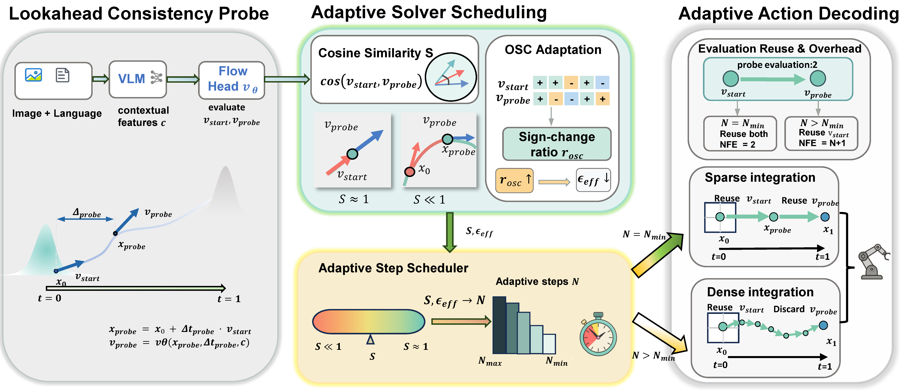

# ProbeFlow

**Training-Free Adaptive Flow Matching for Vision-Language-Action Models**

ProbeFlow accelerates inference for Flow Matching action heads in VLA policies without retraining. A Lookahead Consistency Probe compares initial and lookahead velocity directions, then routes each action chunk to a compact or denser Euler schedule. Optional OSC adapts routing conservatism using the same evaluations.

## Overview

The framework uses a Lookahead Consistency Probe to route each action chunk to an appropriate Flow Matching integration schedule.

[](figures/backbone.png)

## Links

- **Paper:** *ProbeFlow: Training-Free Adaptive Flow Matching for Vision-Language-Action Models* (arXiv link will be added upon release)


## Citation

```bibtex
@inproceedings{probeflow2027,
  title     = {ProbeFlow: Training-Free Adaptive Flow Matching for Vision-Language-Action Models},
  booktitle = {IEEE International Conference on Robotics and Automation},
  year      = {2027}
}
```

## License

See [LICENSE](LICENSE).
